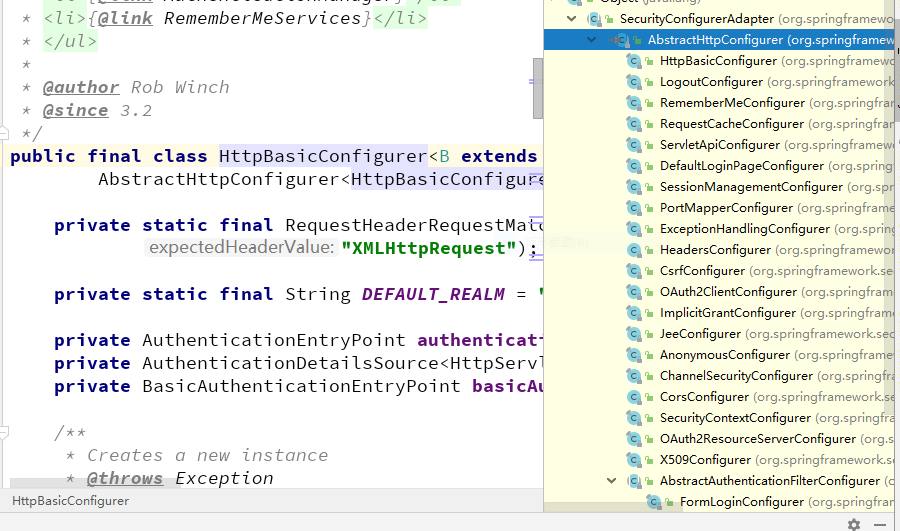
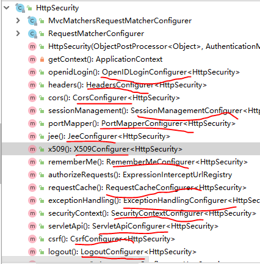

# filterChain如何生成

如果需要设计一个处理检验URL处理器,一种解决思路: 

1. 一个请求过来,对它进行操作,且使用者可以自由的增加一些对request的操作 (用责任链模式,可以动态的添加一层操作)

2. 如果一个filter在不同人手中需要需要实现不同的操作,需要进行不同的配置 (把配置抽离出来, 让使用者可以单独配置)

3. 多个请求过来是否必须经过所有filter处理 (设置条件, 满足条件的处理,否则跳过)

4. 快速上手 (提供一些默认的符合大多数人操作习惯的配置)

## spring security 怎么实现的

###  一个请求过来,对它进行操作,且使用者可以自由的增加一些对request的操作 (用责任链模式,可以动态的添加一层操作)

通过 FilterChainProxy ,来把所有filter都放到 filterChains 这个list 集合中

###  怎么自定的把filter都放置都filterChains 这个过滤器里面去？

通过配置,一个filter 对应一个configuration

可以看下这个类下的子类

```java
AbstractHttpConfigurer
```

对应关系可以参见 附录 ：configuration & filter



### 怎么通过config加载filter 过滤器链

1. filter的config 都可以在 HttpSecurity 可以找到



2. 把配置通过 HttpSecurity中的 getOrApply 调用父类 apply add 方法读到configurers 属性中去

3. HttpSecurity 加载到WebSecurity的securityFilterChainBuilders属性中去； 添加进去后，在WebSecurity对象的build方法中，会调用HttpSecurity父类的doBuild方法生成FilterChain对象。 

4. HttpSecurity的addFilter方法将生成的Filter添加到了HttpSecurity对象中去。authFilter对象实现类型为：　DefaultLoginPageGeneratingFilter。

在Configure方法完成后，HttpSecurity的build方法最终调用的是其performBuild方法


### 怎么确定filter执行顺序

```java
FilterComparator
```

### 默认配置 

### 怎么决定这个filter 是否执行？判断条件


## 附录

### configuration & filter

|Configurer|	Filter|	功能说明|
|:--:|:--:|:--:|
|OpenIDLoginConfigurer|	OpenIDAuthenticationFilter|	处理OpenID授权请求|
|HeadersConfigurer|HeaderWriterFilter|	在返回报文头中添加Security相关信息|
|CorsConfigurer	|CorsFilter	|提供跨域访问配置支持的Filter|
|SessionManagementConfigurer|	SessionManagementFilter|	会话管理Filter|
|PortMapperConfigurer|	无|	用于在Http及Https请求之间重定向时的端口判定|
|JeeConfigurer|	J2eePreAuthenticatedProcessingFilter|	添加J2EE预授权处理机制支持|
|X509Configurer|	X509AuthenticationFilter|	添加X509预授权处理机制支持|
|RememberMeConfigurer|	RememberMeAuthenticationFilter|	记住用户名及密码功能支持|
|ExpressionUrlAuthorizationConfigurer|	FilterSecurityInterceptor|	Security的主要Filter，通过调用权限管理器等进行Http访问的权限判断|
|RequestCacheConfigurer|	RequestCacheAwareFilter|	缓存请求并在必要的时候使用缓存的请求|
|ExceptionHandlingConfigurer|	ExceptionTranslationFilter|	处理AccessDeniedException及AuthenticationException异常|
|SecurityContextConfigurer|	SecurityContextPersistenceFilter|	SecurityContext对象持久化Filter，用于在请求开始阶段初始化并持久化该对象，在后续的Filter中可以使用该对象来获取信息|
|ServletApiConfigurer|	SecurityContextHolderAwareRequestFilter|	在原始请求基础上包装一些方法供后续调用
|CsrfConfigurer	CsrfFilter	跨站请求伪造保护Filter；|
|LogoutConfigurer|	LogoutFilter|	退出登录请求处理Filter|
|AnonymousConfigurer|	AnonymousAuthenticationFilter|	匿名请求控制Filter|
|FormLoginConfigurer|	UsernamePasswordAuthenticationFilter|	表单登录请求处理Filter|
|OAuth2LoginConfigurer|	OAuth2AuthorizationRequestRedirectFilter|	OAuth2请求权限控制处理Filter，为其它网站提供本网站Oauth2方式登录，即其它网站通过本网站的账户密码进行登录授权|
|ChannelSecurityConfigurer|	ChannelProcessingFilter|	通道选择Filter，确保请求是通过正确的通道过来的，如Http或者Https|
|HttpBasicConfigurer|	BasicAuthenticationFilter|	Security基础登录授权Filter，将其结果保存在SecurityContextHolder中|


