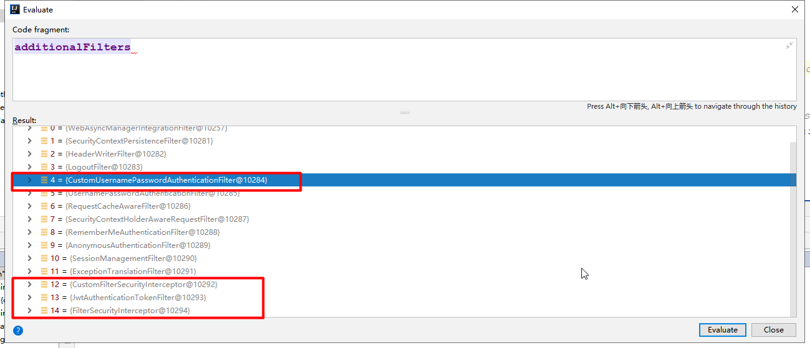
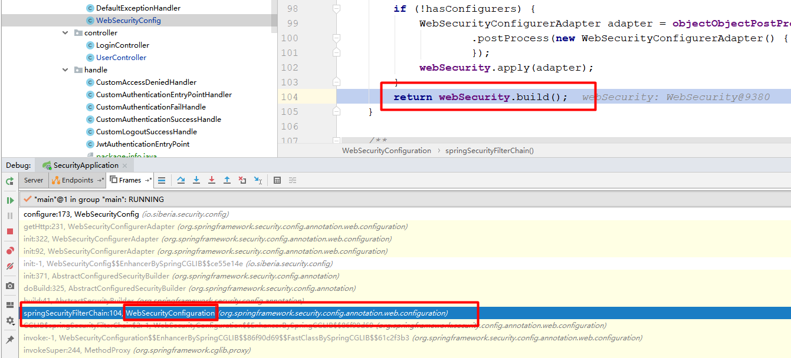

# spring security


## 

认证异常
AuthenticationException

授权异常
AccessDeniedException

## 认证授权流程

UsernamePasswordAuthenticationFilter: 只是其中一种认证方式而已

```uml
@startuml

(*) --> [entry VirtualFilterChain]FilterChainProxy
FilterChainProxy --> UsernamePasswordAuthenticationFilter 
UsernamePasswordAuthenticationFilter --> [entry authorization]AbstractSecurityInterceptor
AbstractSecurityInterceptor --> [decide]AccessDecisionManager
FilterInvocationSecurityMetadataSource -->[authentication resource]AbstractSecurityInterceptor 
AccessDecisionManager--> (*)

@enduml
```

## 答疑

* 在什么时候时候调用了 `UserDetailsService`

在 `DaoAuthenticationProvider`, 这里调用

```uml
@startuml

	Interface AuthenticationManager 
	Class ProviderManager

	Interface AuthenticationProvider
	Class AbstractUserDetailsAuthenticationProvider
	Class DaoAuthenticationProvider

 	AuthenticationManager <|.down. ProviderManager
 	ProviderManager o-right- AuthenticationProvider 
	AuthenticationProvider <|.down. AbstractUserDetailsAuthenticationProvider 
	AbstractUserDetailsAuthenticationProvider <|-down- DaoAuthenticationProvider

@enduml
```

* 在`FilterChainProxy` 中的 `filterChains` 保存了关于一个请求所需要经过处理的过滤链,那么这个过滤链是什么时候加载的？

`WebSecurityConfiguration` 中的 `springSecurityFilterChain` 生成了一个名字叫做 `springSecurityFilterChain`

* 一个url 是否允许访问, 由那些地方控制?

	1. 通过数据库加载配置

	2. 通过spring security 的配置

---

* 认证完成之后,下一个请求还会走认证流程吗？

不会了,是否走认证流程是由设置在`login`的url来判断的,如何url和设置的一直,那么就会走认证流程

认证流程走完了之后,走授权流程

---

* 如何在一个filter前添加一个自定义filter 以及 把官方的替换成自定义的

```java
	/**
	 * 1, 用自定义的 myUsernamePasswordAuthenticationFilter 替换掉原来的
	 * UsernamePasswordAuthenticationFilter
	 * 2. 在 FilterSecurityInterceptor 之前添加两个filter
	 * 
	 * addFilterAt 在原有filter 用配置的filter 来代替
	 * addFilterBefore 在原有 filter 之前添加一个filter
	 */
	
	@Autowired
    private CustomFilterSecurityInterceptor customFilterSecurityInterceptor;

 	@Override
    protected void configure(HttpSecurity http) throws Exception {
        http.addFilterAt(myUsernamePasswordAuthenticationFilter(),
                UsernamePasswordAuthenticationFilter.class);
        http.addFilterBefore(customFilterSecurityInterceptor,
                FilterSecurityInterceptor.class);
        http.addFilterBefore(jwtAuthenticationTokenFilter(),
                FilterSecurityInterceptor.class);
	}
	
	/** bean */

	/**
     * 自定义用户验证码
     *
     * @return
     * @throws Exception
     */
    @Bean
    public UsernamePasswordAuthenticationFilter myUsernamePasswordAuthenticationFilter() throws Exception {
        return new CustomUsernamePasswordAuthenticationFilter(authenticationManagerBean(),
                myAuthenticationSuccessHandler(),
                myAuthenticationFailureHandler());
	}
	
	 /**
     * 注册jwt 认证
     * @return
     * @throws Exception
     */
    @Bean
    public JwtAuthenticationTokenFilter jwtAuthenticationTokenFilter() {

       return new JwtAuthenticationTokenFilter();
    }

```

结果


---

* 什么时候加载filter?

WebSecurityConfiguration 这里 注册了一个bean 且beanname = springSecurityFilterChain

通过 beanname 找到 AbstractSecurityWebApplicationInitializer 下的insertSpringSecurityFilterChain()



## 核心类

### SecurityContextHolder

保存应用程序中当前使用人的安全上下文

### AuthenticationManager

下面的都是以 `AuthenticationManager` 为基础, 进行用户认证操作 - 这里的不是源码

```uml
@startuml

	Interface AuthenticationManager 
	Class ProviderManager

	Interface AuthenticationProvider
	Class AbstractUserDetailsAuthenticationProvider
	Class DaoAuthenticationProvider

 	AuthenticationManager <|.down. ProviderManager
 	ProviderManager o-right- AuthenticationProvider 
	AuthenticationProvider <|.down. AbstractUserDetailsAuthenticationProvider 
	AbstractUserDetailsAuthenticationProvider <|-down- DaoAuthenticationProvider

@enduml
```

#### AuthenticationManager

处理认证请求

```java
/**
 * Processes an {@link Authentication} request.
 */
public interface AuthenticationManager {

	Authentication authenticate(Authentication authentication)
			throws AuthenticationException;
}
```

#### ProviderManager

AuthenticationManager 中的一个实现类, 进行认证操作

```java
public class ProviderManager implements AuthenticationManager, MessageSourceAware,
		InitializingBean {

	private List<AuthenticationProvider> providers = Collections.emptyList();

	public Authentication authenticate(Authentication authentication)
			throws AuthenticationException {
		Authentication result = null;

		for (AuthenticationProvider provider : providers) {
			result = provider.authenticate(authentication);
			copyDetails(authentication, result);
		}

		if (result == null && parent != null) {
			result = parentResult = parent.authenticate(authentication);
		}

		return result;
	}

}
```

#### AuthenticationProvider

ProviderManager 引用了 AuthenticationProvider接口集合

```java
public interface AuthenticationProvider {

	Authentication authenticate(Authentication authentication)
			throws AuthenticationException;

	boolean supports(Class<?> authentication);
}
```

#### AbstractUserDetailsAuthenticationProvider

AbstractUserDetailsAuthenticationProvider 通过 authenticate 进行用户认证, 且认证成功之后, 之后,信息封装到 Authentication 里面

```java
public abstract class AbstractUserDetailsAuthenticationProvider implements
		AuthenticationProvider, InitializingBean, MessageSourceAware {

	public Authentication authenticate(Authentication authentication)
			throws AuthenticationException{
		String username = (authentication.getPrincipal() == null) ? "NONE_PROVIDED"
				: authentication.getName();		

		user = retrieveUser(username,
						(UsernamePasswordAuthenticationToken) authentication);

		Object principalToReturn = user;

		return createSuccessAuthentication(principalToReturn, authentication, user);
	}


	protected abstract UserDetails retrieveUser(String username,
			UsernamePasswordAuthenticationToken authentication)
			throws AuthenticationException;

	protected Authentication createSuccessAuthentication(Object principal,
			Authentication authentication, UserDetails user) {
		UsernamePasswordAuthenticationToken result = new UsernamePasswordAuthenticationToken(
				principal, authentication.getCredentials(),
				authoritiesMapper.mapAuthorities(user.getAuthorities()));
		result.setDetails(authentication.getDetails());

		return result;
	}
}
```

#### DaoAuthenticationProvider

调用了`UserDetailsService` 接口,

```java
public class DaoAuthenticationProvider extends AbstractUserDetailsAuthenticationProvider {

	private UserDetailsService userDetailsService;

	protected final UserDetails retrieveUser(String username,
			UsernamePasswordAuthenticationToken authentication) throws AuthenticationException {
		
		UserDetails loadedUser = this.getUserDetailsService().loadUserByUsername(username);
		
		return loadedUser;
	}
}
```

### UserDetails & UserDetailsService

* UserDetails

用户信息,包括权限, 用户名, 密码,账号是否过期,账号是否被锁定,密码是否过期,账号是否可用等

* UserDetailsService

获取用户信息: UserDetails loadUserByUsername(String username);


### Authentication

看图, 这个是根据用户认证方式来划分多种存储用户认证成功之后的信息

```uml
@startuml

	Interface Authentication 
	Class AbstractAuthenticationToken
	Class UsernamePasswordAuthenticationToken
	Class AnonymousAuthenticationToken

 	Authentication <|-- AbstractAuthenticationToken
 	AbstractAuthenticationToken <|-- UsernamePasswordAuthenticationToken 
 	AbstractAuthenticationToken <|-- AnonymousAuthenticationToken 
	

@enduml
```

#### Authentication

```java
public interface Authentication extends Principal, Serializable {

	Collection<? extends GrantedAuthority> getAuthorities();

	Object getCredentials();

	Object getDetails();

	Object getPrincipal();

	boolean isAuthenticated();

	void setAuthenticated(boolean isAuthenticated) throws IllegalArgumentException;
}
```


GrantedAuthority: 授权

AccessDecisionManager


### 配置

WebSecurityConfiguration

WebSecurity

### authentication - 认证
`FilterChinaProxy` 内部内有一个静态内部类 `VirtualFilterChain` 过滤请求
这里只要主要是`doFilter`方法 

用到一个责任链模式, 就是一个请求过来, 一些操作,可以方便的增加或删除校验

主要的操作,都在`VirtualFilterChain` 下的  `doFilter` 里面执行

```java
public class FilterChainProxy extends GenericFilterBean {

	private List<SecurityFilterChain> filterChains;

	public FilterChainProxy(List<SecurityFilterChain> filterChains) {
		this.filterChains = filterChains;
	}

	public void doFilter(ServletRequest request, ServletResponse response
        ,FilterChain chain) {
		doFilterInternal(request, response, chain);
		SecurityContextHolder.clearContext();
	}

	private void doFilterInternal(ServletRequest request, ServletResponse response
            ,FilterChain chain) {

		FirewalledRequest fwRequest = firewall
				.getFirewalledRequest((HttpServletRequest) request);
		HttpServletResponse fwResponse = firewall
				.getFirewalledResponse((HttpServletResponse) response);

		List<Filter> filters = getFilters(fwRequest);

		VirtualFilterChain vfc = new VirtualFilterChain(fwRequest, chain, filters);
		vfc.doFilter(fwRequest, fwResponse);
	}

	private static class VirtualFilterChain implements FilterChain {
		private final FilterChain originalChain;
		private final List<Filter> additionalFilters;
		private final int size;
		private int currentPosition = 0;

		private VirtualFilterChain(FirewalledRequest firewalledRequest,
				FilterChain chain, List<Filter> additionalFilters) {
			this.originalChain = chain;
			this.additionalFilters = additionalFilters;
			this.size = additionalFilters.size();
		}

		@Override
		public void doFilter(ServletRequest request, ServletResponse response)
				throws IOException, ServletException {
			if (currentPosition == size) {
				originalChain.doFilter(request, response);
			}
			else {
				currentPosition++;
				Filter nextFilter = additionalFilters.get(currentPosition - 1);
				nextFilter.doFilter(request, response, this);
			}
		}
	}

}

```

这里以 UsernamerPassword 认证方式为列，安装顺序进过的 `Filter`

`WebAsyncManagerIntegrationFilter`: 给 `WebAsyncManager` 一个字段赋值

`SecurityContextPersistenceFilter`: 设置一些需要在安全认证中传递的数据, 默认是使用ThreadLocal
    `SecurityContextHolder` 类中的 strategy 字段 , 可以找到 `ThreadLocalSecurityContextHolderStrategy`

`HeaderWriterFilter`: 转换 request 和 response 类型为 HeaderWriterRequest, HeaderWriterResponse,

`LogoutFilter`: 是否是要退出的url(为什么可以知道哪个uri是退出的？肯定是配置啦)

`UsernamePasswordAuthenticationFilter`: 的dofilter在他的父类 `AbstractAuthenticationProcessingFilter`里面,
    根据请求的用户名密码封装成一个 `UsernamePasswordAuthenticationToken` 对象
    然后 通过接口 `AuthenticationManager` 的实现类 `ProviderManager`中的 `authenticate` 方法进行校验  
    就是在这里会通过 `DaoAuthenticationProvider` 中的`retrieveUser` 方法去调用 自己写的 实现`UserDetailsService` 中的`loadUserByUsername` 调用方法
    


### authorization - 授权

在用户认证完成之后, 会对校验是否该用户有访问该接口的权限，通过角色来控制

这里说明一点，security 模式是用session 来保存用户信息的,但是如果要用别的,比如jwt 来保存, 我们一样也需要

## 源码

#### 责任链模式

#### 策略模式

#### 单例模式


## spring boot security 默认配置

## 自定义spring security 用户认证逻辑

spring-security 里面封装了接口逻辑, 调用者只要实现了接口,就可以自定义逻辑了

#### 用户信息获取逻辑 UserDetailsService
 
#### 用户校验逻辑 UserDetails

#### 加密解密逻辑 PasswordEncoder

#### 自定义登录页面(配置)

#### 登录成功处理

#### 登录失败处理

#### 过滤器链
WebAsyncManagerIntegrationFilter@1d99c57d
SecurityContextPersistenceFilter@4670e2c6
HeaderWriterFilter@4ecb6b07
LogoutFilter@48fe96fe
UsernamePasswordAuthenticationFilter@12c6f30a
DefaultLoginPageGeneratingFilter@3beb7796
DefaultLogoutPageGeneratingFilter@610639d6
RequestCacheAwareFilter@3f1875ec
SecurityContextHolderAwareRequestFilter@70f3dc33
AnonymousAuthenticationFilter@1e7e5364
SessionManagementFilter@389da349
ExceptionTranslationFilter@477fb9ad 
FilterSecurityInterceptor@1d74b37

## 授权

## csrf 跨站伪造防护

## 附录

### 问题

Q1: 前后端分离 OPTIONS 

	reason 1: spring security 拦截了

	reason 2: 请求目的地址无访问权限

	reason 3: 请求方法错误 get 

02: json 登录


### idea 快捷键

Ctrl + H 看到该类的父子类


